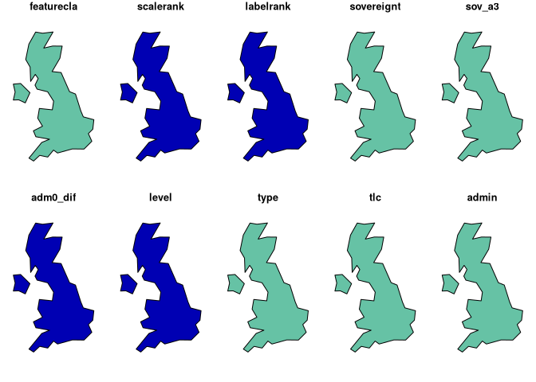
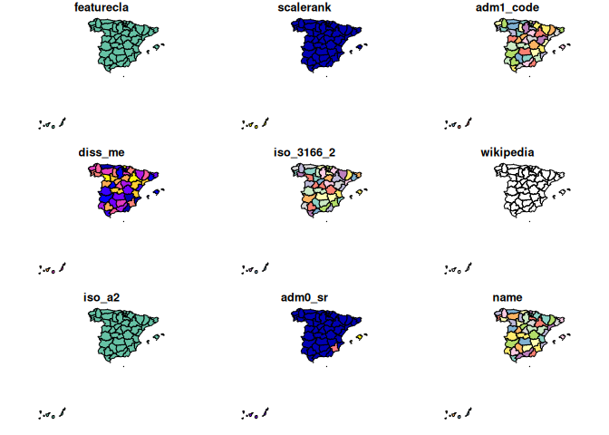

<!-- README.md is generated from README.Rmd. Please edit that file -->
<!-- used devtools::build_readme() to update the md -->
<!-- badges: start -->

[](https://CRAN.R-project.org/package=rnaturalearth)
[](https://github.com/ropensci/software-review/issues/22)
[](https://www.repostatus.org/#active)
[](https://github.com/ropensci/rnaturalearth/actions/workflows/R-CMD-check.yaml)

<!-- badges: end -->

# rnaturalearth

An R package to hold and facilitate interaction with [Natural
Earth](https://www.naturalearthdata.com/) map data.

This package provides :

-   access to a pre-downloaded subset of Natural Earth v4.1.0
    (March 2018) vector data commonly used in world mapping

-   easy subsetting by countries and regions

-   functions to download other Natural Earth vector and raster data

-   a simple, reproducible and sustainable workflow from Natural Earth
    data to rnaturalearth enabling updating as new versions become
    available

-   clarification of differences in world maps classified by countries,
    sovereign states and map units

-   consistency with Natural Earth naming conventions so that
    rnaturalearth users can use Natural Earth documentation

-   data in `sf` or `sv` formats

The [Natural Earth](https://www.naturalearthdata.com/) website
structures vector data by scale, category and type. These determine the
filenames of downloads. rnaturalearth uses this structure to facilitate
download (like an API).

## Install rnaturalearth

Install from CRAN :

``` r
install.packages("rnaturalearth")
```

or install the development version from GitHub using
[devtools](https://github.com/r-lib/devtools).

``` r
devtools::install_github("ropensci/rnaturalearth")
```

Data to support much of the package functionality are stored in two data
packages that you will be prompted to install when required if you do
not do so here.

``` r
devtools::install_github("ropensci/rnaturalearthdata")
devtools::install_github("ropensci/rnaturalearthhires")
```

## First usage

Here using `plot` as a simple, quick way to plot maps. Maps could also
be made with `ggplot2`, `tmap` or other options. All retrieval functions
accept an argument `returnclass = "sf"` to return package `sf` (Simple
Features) objects.

``` r
library(rnaturalearth)

# world countries
plot(ne_countries())
Warning: plotting the first 9 out of 168 attributes; use max.plot = 168 to plot
all
```

<!-- -->

``` r
# uk
plot(ne_countries(country = "united kingdom"))
Warning: plotting the first 10 out of 168 attributes; use max.plot = 168 to
plot all
```

<!-- -->

``` r
# states, admin level1 boundaries
plot(ne_states(country = "spain"))
Warning: plotting the first 9 out of 121 attributes; use max.plot = 121 to plot
all
```

<!-- -->

## Introductory vignette

``` r
vignette("rnaturalearth", package = "rnaturalearth")
```

## To download Natural Earth data not already in the package

There are a wealth of other data available at the [Natural
Earth](https://www.naturalearthdata.com/) website. `rnaturalearth` has
functions to help with download of these data.

The data available are outlined in the two tables below and online
[here](https://www.naturalearthdata.com/downloads/50m-physical-vectors/).


    category   cultural 

    category   physical 

Specify the `scale`, `category` and `type` of the vector you want as in
the examples below.

``` r
# lakes
lakes110 <- ne_download(scale = 110, type = "lakes", category = "physical")
plot(lakes110)

# rivers
rivers50 <- ne_download(
  scale = 50,
  type = "rivers_lake_centerlines",
  category = "physical",
  returnclass = "sf"
)

library(ggplot2)
library(sf)

ggplot(rivers50) +
  geom_sf() +
  theme_minimal()
```

## Details of different country definitions and scales

``` r
vignette("what-is-a-country", package = "rnaturalearth")
```

## Reproducible download of Natural Earth data into the package

[Script](https://github.com/ropensci/rnaturalearthdata/blob/master/data-raw/data_download_script.r)
used to get data into the accompanying data packages.

## Acknowledgements

Thanks to [Lincoln Mullen](https://github.com/lmullen) for code
structure inspiration from
[USAboundaries](https://github.com/ropensci/USAboundaries), [Hadley
Wickham](https://github.com/hadley) for comments and prompting, [Bob
Rudis](https://github.com/hrbrmstr) for answers to stackoverflow
questions about downloading Natural Earth data into R. The [Natural
Earth team](https://www.naturalearthdata.com/about/contributors/) and
[Nathan Kelso](https://github.com/nvkelso) for providing such a great
resource.

## Potential future work

### Potential additional data

-   Country synonyms lookup
    -   dataframe with ISO3 and country synonyms
    -   similar to
        <https://github.com/AndySouth/rworldmap/blob/master/data/countrySynonyms.rda>
-   Country larger regions lookup
    -   dataframe with ISO3 and membership of different regional
        groupings, e.g. continent, least developed countries etc.
    -   similar to
        <https://github.com/AndySouth/rworldmap/blob/master/data/countryRegions.rda>

### Potential additional functions

-   facilitate joining of user data to country boundaries

    -   similar to
        <https://github.com/AndySouth/rworldmap/blob/master/R/joinCountryData2Map.R>
    -   … but with a better name
    -   similar allowing of join by ISO codes or names, with attempted
        synonym matching
    -   similar reporting of country joining success and failure

-   facilitate subsetting by country groupings

    -   e.g. least developed countries etc.
