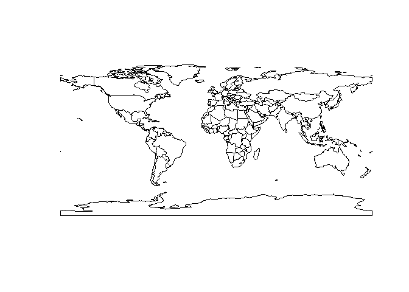
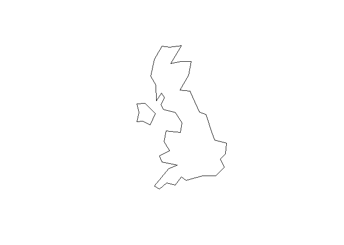
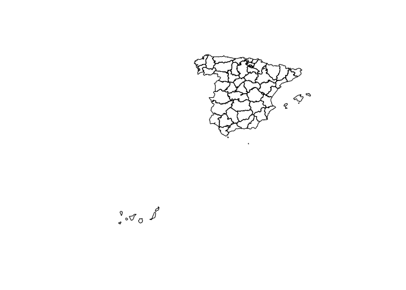

<!-- README.md is generated from README.Rmd. Please edit that file -->

<!-- used devtools::build_readme() to update the md -->

[](https://cran.r-project.org/package=rnaturalearth)
[](https://cran.r-project.org/package=rnaturalearth)
[](https://cran.r-project.org/package=rnaturalearth)
[](https://github.com/ropensci/software-review/issues/22)
[](https://www.repostatus.org/#active)

[](https://travis-ci.org/ropensci/rnaturalearth)
[](https://ci.appveyor.com/project/AndySouth/rnaturalearth)

# rnaturalearth

An R package to hold and facilitate interaction with [Natural
Earth](https://www.naturalearthdata.com/) map data.

### Provides :

1.  access to a pre-downloaded subset of Natural Earth v4.1.0 (March
    2018) vector data commonly used in world mapping
2.  easy subsetting by countries and regions
3.  functions to download other Natural Earth vector and raster data
4.  a simple, reproducible and sustainable workflow from Natural Earth
    data to rnaturalearth enabling updating as new versions become
    available
5.  clarification of differences in world maps classified by countries,
    sovereign states and map units
6.  consistency with Natural Earth naming conventions so that
    rnaturalearth users can use Natural Earth documentation
7.  data in ‘sf’ or ‘sp’ formats

The [Natural Earth](https://www.naturalearthdata.com/) website
structures vector data by scale, category and type. These determine the
filenames of downloads. rnaturalearth uses this structure to facilitate
download (like an API).

### Install rnaturalearth

Install from CRAN :

    install.packages("rnaturalearth")

or install the development version from GitHub using
[devtools](https://github.com/r-lib/devtools).

    devtools::install_github("ropensci/rnaturalearth")

Data to support much of the package functionality are stored in two data
packages that you will be prompted to install when required if you do
not do so here.

    devtools::install_github("ropensci/rnaturalearthdata")
    devtools::install_github("ropensci/rnaturalearthhires")

### First Usage

Here using `sp::plot` as a simple, quick way to plot maps. Maps could
also be made with `ggplot2`, `tmap` or other options. All retrieval
functions accept an argument `returnclass='sf'` to return package `sf`
(Simple Features) objects.

``` r
library(rnaturalearth)
library(sp)

# world countries
sp::plot(ne_countries())
```

<!-- -->

``` r
# uk
sp::plot(ne_countries(country = "united kingdom"))
```

<!-- -->

``` r
# states, admin level1 boundaries
sp::plot(ne_states(country = "spain"))
```

<!-- -->

### Introductory vignette

``` r
vignette("rnaturalearth", package = "rnaturalearth")
```

### To download Natural Earth data not already in the package

There are a wealth of other data available at the [Natural
Earth](https://www.naturalearthdata.com/) website. `rnaturalearth` has
functions to help with download of these data.

The data available are outlined in the two tables below and online
[here](https://www.naturalearthdata.com/downloads/50m-physical-vectors/).

``` 

category   cultural 
                                type scale110 scale50 scale10
1                          countries     TRUE    TRUE    TRUE
2                          map_units     TRUE    TRUE    TRUE
3                       map_subunits    FALSE    TRUE    TRUE
4                        sovereignty     TRUE    TRUE    TRUE
5                     tiny_countries     TRUE    TRUE    TRUE
6                             states    FALSE    TRUE    TRUE
7                   populated_places     TRUE    TRUE    TRUE
8                boundary_lines_land     TRUE    TRUE    TRUE
9                  pacific_groupings     TRUE    TRUE    TRUE
10          breakaway_disputed_areas    FALSE    TRUE    TRUE
11     boundary_lines_disputed_areas    FALSE    TRUE    TRUE
12 boundary_lines_maritime_indicator    FALSE    TRUE    TRUE
13                          airports    FALSE    TRUE    TRUE
14                             ports    FALSE    TRUE    TRUE
15                       urban_areas    FALSE    TRUE    TRUE
16                             roads    FALSE   FALSE    TRUE
17                         railroads    FALSE   FALSE    TRUE

category   physical 
                                 type scale110 scale50 scale10
1                           coastline     TRUE    TRUE    TRUE
2                                land     TRUE    TRUE    TRUE
3                               ocean     TRUE    TRUE    TRUE
4             rivers_lake_centerlines     TRUE    TRUE    TRUE
5  rivers_lake_centerlines_scale_rank    FALSE    TRUE    TRUE
6                       rivers_europe    FALSE   FALSE    TRUE
7                rivers_north_america    FALSE   FALSE    TRUE
8                               lakes     TRUE    TRUE    TRUE
9                     glaciated_areas     TRUE    TRUE    TRUE
10        antarctic_ice_shelves_polys     TRUE    TRUE    TRUE
11                   geographic_lines     TRUE    TRUE    TRUE
12                       graticules_1     TRUE    TRUE    TRUE
13                       graticules_5     TRUE    TRUE    TRUE
14                      graticules_10     TRUE    TRUE    TRUE
15                      graticules_15     TRUE    TRUE    TRUE
16                      graticules_20     TRUE    TRUE    TRUE
17                      graticules_30     TRUE    TRUE    TRUE
18                 wgs84_bounding_box     TRUE    TRUE    TRUE
19                             playas    FALSE    TRUE    TRUE
20                      minor_islands    FALSE   FALSE    TRUE
21                              reefs    FALSE   FALSE    TRUE
```

Specify the `scale`, `category` and `type` of the vector you want as in
the examples below.

``` r
# lakes
lakes110 <- ne_download(scale = 110, type = "lakes", category = "physical")
sp::plot(lakes110)

# rivers
rivers50 <- ne_download(scale = 50, type = "rivers_lake_centerlines", category = "physical")
sp::plot(rivers50)
```

### Details of different country definitions and scales

``` r
vignette("what-is-a-country", package = "rnaturalearth")
```

## Reproducible download of Natural Earth data into the package

[Script](https://github.com/ropensci/rnaturalearthdata/blob/master/data-raw/data_download_script.r)
used to get data into the accompanying data packages.

## Acknowledgements

Thanks to [Lincoln Mullen](https://github.com/lmullen) for code
structure inspiration from
[USAboundaries](https://github.com/ropensci/USAboundaries), [Hadley
Wickham](https://github.com/hadley) for comments and prompting, [Bob
Rudis](https://github.com/hrbrmstr) for answers to stackoverflow
questions about downloading Natural Earth data into R. The [Natural
Earth team](https://www.naturalearthdata.com/about/contributors/) and
[Nathan Kelso](https://github.com/nvkelso) for providing such a great
resource.

## Potential future work

### potential additional data

1.  Country synonyms lookup
      - dataframe with ISO3 and country synonyms
      - similar to
        <https://github.com/AndySouth/rworldmap/blob/master/data/countrySynonyms.rda>
2.  Country larger regions lookup
      - dataframe with ISO3 and membership of different regional
        groupings, e.g. continent, least developed countries etc.
      - similar to
        <https://github.com/AndySouth/rworldmap/blob/master/data/countryRegions.rda>

### potential additional functions

1.  facilitate joining of user data to country boundaries
      - similar to
        <https://github.com/AndySouth/rworldmap/blob/master/R/joinCountryData2Map.R>
      - … but with a better name
      - similar allowing of join by ISO codes or names, with attempted
        synonym matching
      - similar reporting of country joining success and failure
2.  facilitate subsetting by country groupings
      - e.g. least developed countries etc.

[](https://ropensci.org)
