# Finding data

``` r
library(rnaturalearth)
library(sf)
#> Linking to GEOS 3.12.1, GDAL 3.8.5, PROJ 9.4.0; sf_use_s2() is TRUE
```

## Available data

There are a lot of data that can be downloaded from [Natural
Earth](https://www.naturalearthdata.com/) with
[`ne_download()`](http://ropensci.github.io/rnaturalearth/reference/ne_download.md).
These data are divided into two main categories: *physical* and
*cultural* vector data. The `df_layers_physical` and
`df_layers_cultural` data frames included in the `rnaturalearth`
packages show what layer of data can be downloaded.

### Physical vector data

``` r
data(df_layers_physical)

knitr::kable(
  df_layers_physical,
  caption = "physical vector data available via ne_download()"
)
```

| layer                              | scale10 | scale50 | scale110 |
|:-----------------------------------|--------:|--------:|---------:|
| antarctic_ice_shelves_lines        |       1 |       1 |        0 |
| antarctic_ice_shelves_polys        |       1 |       1 |        0 |
| coastline                          |       1 |       1 |        1 |
| geographic_lines                   |       1 |       1 |        1 |
| geography_marine_polys             |       1 |       1 |        1 |
| geography_regions_elevation_points |       1 |       1 |        1 |
| geography_regions_points           |       1 |       1 |        1 |
| geography_regions_polys            |       1 |       1 |        1 |
| glaciated_areas                    |       1 |       1 |        1 |
| lakes                              |       1 |       1 |        1 |
| lakes_europe                       |       1 |       0 |        0 |
| lakes_historic                     |       1 |       1 |        0 |
| lakes_north_america                |       1 |       0 |        0 |
| lakes_pluvial                      |       1 |       0 |        0 |
| land                               |       1 |       1 |        1 |
| land_ocean_label_points            |       1 |       0 |        0 |
| land_ocean_seams                   |       1 |       0 |        0 |
| land_scale_rank                    |       1 |       0 |        0 |
| minor_islands                      |       1 |       0 |        0 |
| minor_islands_coastline            |       1 |       0 |        0 |
| minor_islands_label_points         |       1 |       0 |        0 |
| ocean                              |       1 |       1 |        1 |
| ocean_scale_rank                   |       1 |       0 |        0 |
| playas                             |       1 |       1 |        0 |
| reefs                              |       1 |       0 |        0 |
| rivers_europe                      |       1 |       0 |        0 |
| rivers_lake_centerlines            |       1 |       1 |        1 |
| rivers_lake_centerlines_scale_rank |       1 |       1 |        0 |
| rivers_north_america               |       1 |       0 |        0 |

physical vector data available via ne_download()

Based on the previous table, we know that we can download the `ocean`
vector at small scale (110). Note that scales are defined as one of
`110`, `50`, `10` or `small`, `medium`, `large`.

``` r
plot(
  ne_download(type = "ocean", category = "physical", scale = "small")[
    "geometry"
  ],
  col = "lightblue"
)
#> Reading 'ne_110m_ocean.zip' from naturalearth...
```

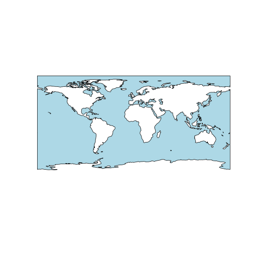

### Cultural vector data

``` r
data(df_layers_cultural)

knitr::kable(
  df_layers_cultural,
  caption = "cultural vector data available via ne_download()"
)
```

| layer                                           | scale10 | scale50 | scale110 |
|:------------------------------------------------|--------:|--------:|---------:|
| admin_0_antarctic_claim_limit_lines             |       1 |       0 |        0 |
| admin_0_antarctic_claims                        |       1 |       0 |        0 |
| admin_0_boundary_lines_disputed_areas           |       1 |       1 |        0 |
| admin_0_boundary_lines_land                     |       1 |       1 |        1 |
| admin_0_boundary_lines_map_units                |       1 |       0 |        0 |
| admin_0_boundary_lines_maritime_indicator       |       1 |       1 |        0 |
| admin_0_boundary_map_units                      |       0 |       1 |        0 |
| admin_0_breakaway_disputed_areas                |       0 |       1 |        0 |
| admin_0_countries                               |       1 |       1 |        1 |
| admin_0_countries_lakes                         |       1 |       1 |        1 |
| admin_0_disputed_areas                          |       1 |       0 |        0 |
| admin_0_disputed_areas_scale_rank_minor_islands |       1 |       0 |        0 |
| admin_0_label_points                            |       1 |       0 |        0 |
| admin_0_map_subunits                            |       1 |       1 |        0 |
| admin_0_map_units                               |       1 |       1 |        1 |
| admin_0_pacific_groupings                       |       1 |       1 |        1 |
| admin_0_scale_rank                              |       1 |       1 |        1 |
| admin_0_scale_rank_minor_islands                |       1 |       0 |        0 |
| admin_0_seams                                   |       1 |       0 |        0 |
| admin_0_sovereignty                             |       1 |       1 |        1 |
| admin_0_tiny_countries                          |       0 |       1 |        1 |
| admin_0_tiny_countries_scale_rank               |       0 |       1 |        0 |
| admin_1_label_points                            |       1 |       0 |        0 |
| admin_1_seams                                   |       1 |       0 |        0 |
| admin_1_states_provinces                        |       1 |       1 |        1 |
| admin_1_states_provinces_lakes                  |       1 |       1 |        1 |
| admin_1_states_provinces_lines                  |       1 |       1 |        1 |
| admin_1_states_provinces_scale_rank             |       1 |       1 |        1 |
| airports                                        |       1 |       1 |        0 |
| parks_and_protected_lands_area                  |       1 |       0 |        0 |
| parks_and_protected_lands_line                  |       1 |       0 |        0 |
| parks_and_protected_lands_point                 |       1 |       0 |        0 |
| parks_and_protected_lands_scale_rank            |       1 |       0 |        0 |
| populated_places                                |       1 |       1 |        1 |
| populated_places_simple                         |       1 |       1 |        1 |
| ports                                           |       1 |       1 |        0 |
| railroads                                       |       1 |       0 |        0 |
| railroads_north_america                         |       1 |       0 |        0 |
| roads                                           |       1 |       0 |        0 |
| roads_north_america                             |       1 |       0 |        0 |
| time_zones                                      |       1 |       0 |        0 |
| urban_areas                                     |       1 |       1 |        0 |
| urban_areas_landscan                            |       1 |       0 |        0 |

cultural vector data available via ne_download()

``` r
plot(
  ne_download(
    type = "airports",
    category = "cultural",
    scale = 10L
  )["geometry"],
  pch = 21L,
  bg = "grey"
)
#> Reading 'ne_10m_airports.zip' from naturalearth...
```

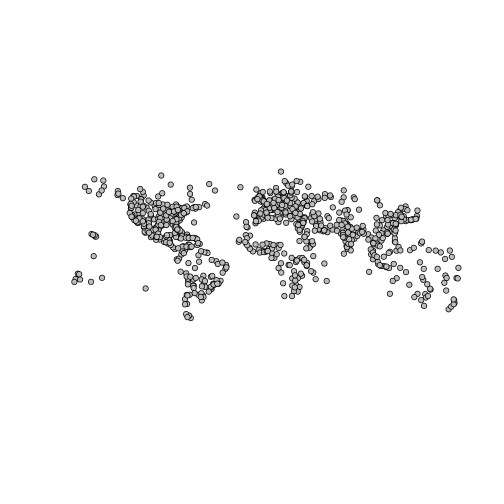

## Searching for countries and continents

In this article, we explore how we can search for data available to
download within `rnaturalearth`. Let’s begin by loading country data
using the
[`read_sf()`](https://r-spatial.github.io/sf/reference/st_read.html)
function from the `sf` package. In the following code snippet, we read
the Natural Earth dataset, which contains information about the
sovereignty of countries.

``` r
df <- read_sf(
  "/vsizip/vsicurl/https://naciscdn.org/naturalearth/10m/cultural/ne_10m_admin_0_sovereignty.zip"
)

head(df)
#> Simple feature collection with 6 features and 168 fields
#> Geometry type: MULTIPOLYGON
#> Dimension:     XY
#> Bounding box:  xmin: -109.4537 ymin: -55.9185 xmax: 140.9776 ymax: 7.35578
#> Geodetic CRS:  WGS 84
#> # A tibble: 6 × 169
#>   featurecla     scalerank LABELRANK SOVEREIGNT SOV_A3 ADM0_DIF LEVEL TYPE  TLC   ADMIN ADM0_A3
#>   <chr>              <int>     <int> <chr>      <chr>     <int> <int> <chr> <chr> <chr> <chr>  
#> 1 Admin-0 sover…         5         2 Indonesia  IDN           0     2 Sove… 1     Indo… IDN    
#> 2 Admin-0 sover…         5         3 Malaysia   MYS           0     2 Sove… 1     Mala… MYS    
#> 3 Admin-0 sover…         0         2 Chile      CHL           0     2 Sove… 1     Chile CHL    
#> 4 Admin-0 sover…         0         3 Bolivia    BOL           0     2 Sove… 1     Boli… BOL    
#> 5 Admin-0 sover…         0         2 Peru       PER           0     2 Sove… 1     Peru  PER    
#> 6 Admin-0 sover…         0         2 Argentina  ARG           0     2 Sove… 1     Arge… ARG    
#> # ℹ 158 more variables: GEOU_DIF <int>, GEOUNIT <chr>, GU_A3 <chr>, SU_DIF <int>,
#> #   SUBUNIT <chr>, SU_A3 <chr>, BRK_DIFF <int>, NAME <chr>, NAME_LONG <chr>, BRK_A3 <chr>,
#> #   BRK_NAME <chr>, BRK_GROUP <chr>, ABBREV <chr>, POSTAL <chr>, FORMAL_EN <chr>,
#> #   FORMAL_FR <chr>, NAME_CIAWF <chr>, NOTE_ADM0 <chr>, NOTE_BRK <chr>, NAME_SORT <chr>,
#> #   NAME_ALT <chr>, MAPCOLOR7 <int>, MAPCOLOR8 <int>, MAPCOLOR9 <int>, MAPCOLOR13 <int>,
#> #   POP_EST <dbl>, POP_RANK <int>, POP_YEAR <int>, GDP_MD <int>, GDP_YEAR <int>,
#> #   ECONOMY <chr>, INCOME_GRP <chr>, FIPS_10 <chr>, ISO_A2 <chr>, ISO_A2_EH <chr>,
#> #   ISO_A3 <chr>, ISO_A3_EH <chr>, ISO_N3 <chr>, ISO_N3_EH <chr>, UN_A3 <chr>, WB_A2 <chr>,
#> #   WB_A3 <chr>, WOE_ID <int>, WOE_ID_EH <int>, WOE_NOTE <chr>, ADM0_ISO <chr>,
#> #   ADM0_DIFF <chr>, ADM0_TLC <chr>, ADM0_A3_US <chr>, ADM0_A3_FR <chr>, ADM0_A3_RU <chr>,
#> #   ADM0_A3_ES <chr>, ADM0_A3_CN <chr>, ADM0_A3_TW <chr>, ADM0_A3_IN <chr>, ADM0_A3_NP <chr>,
#> #   ADM0_A3_PK <chr>, ADM0_A3_DE <chr>, ADM0_A3_GB <chr>, ADM0_A3_BR <chr>, ADM0_A3_IL <chr>,
#> #   ADM0_A3_PS <chr>, ADM0_A3_SA <chr>, ADM0_A3_EG <chr>, ADM0_A3_MA <chr>, ADM0_A3_PT <chr>,
#> #   ADM0_A3_AR <chr>, ADM0_A3_JP <chr>, ADM0_A3_KO <chr>, ADM0_A3_VN <chr>, ADM0_A3_TR <chr>,
#> #   ADM0_A3_ID <chr>, ADM0_A3_PL <chr>, ADM0_A3_GR <chr>, ADM0_A3_IT <chr>, ADM0_A3_NL <chr>,
#> #   ADM0_A3_SE <chr>, ADM0_A3_BD <chr>, ADM0_A3_UA <chr>, ADM0_A3_UN <int>, ADM0_A3_WB <int>,
#> #   CONTINENT <chr>, REGION_UN <chr>, SUBREGION <chr>, REGION_WB <chr>, NAME_LEN <int>,
#> #   LONG_LEN <int>, ABBREV_LEN <int>, TINY <int>, HOMEPART <int>, MIN_ZOOM <dbl>,
#> #   MIN_LABEL <dbl>, MAX_LABEL <dbl>, LABEL_X <dbl>, LABEL_Y <dbl>, NE_ID <dbl>,
#> #   WIKIDATAID <chr>, NAME_AR <chr>, NAME_BN <chr>, NAME_DE <chr>, …
```

### Finding countries

One way to search for countries is to search within the `ADMIN` vector.
Let’s start by plotting some of the first countries.

``` r

lapply(
  df$ADMIN[1L:6L],
  \(x) plot(ne_countries(country = x)["geometry"], main = x)
)
```

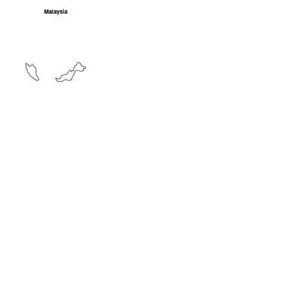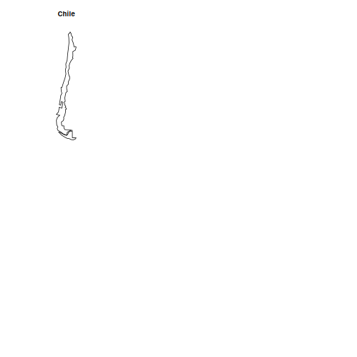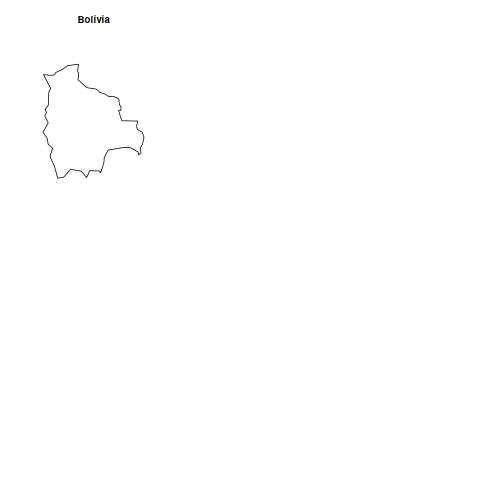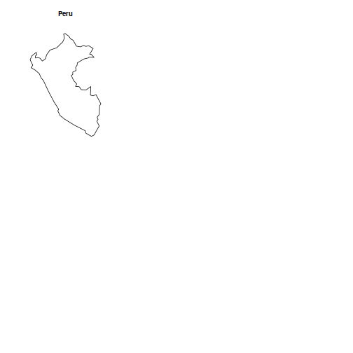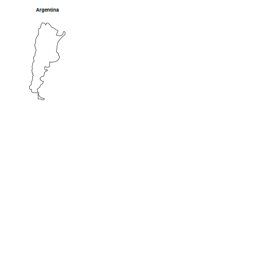

Suppose that we want to search the polygons for the US, how should we
spell it?

``` r
ne_countries(country = "USA")
ne_countries(country = "United States")
ne_countries(country = "United States Of America")
ne_countries(country = "United States of America")
```

One possibility consists to search within the `ADMIN` vector using a
regular expression to find all occurrences of the word *states*.

``` r
grep("states", df$ADMIN, ignore.case = TRUE, value = TRUE)
#> [1] "United States of America"       "Federated States of Micronesia"
```

We can now get the data.

``` r
plot(ne_countries(country = "United States of America")["geometry"])
```


### Continents

Finally, let’s create plots for each continent using the `ne_countries`
function with the continent parameter.

``` r
unique(df$CONTINENT)
#> [1] "Asia"                    "South America"           "Europe"                 
#> [4] "Africa"                  "North America"           "Oceania"                
#> [7] "Antarctica"              "Seven seas (open ocean)"
```

``` r

lapply(
  unique(df$CONTINENT),
  \(x)
    plot(
      ne_countries(
        continent = x,
        scale = "medium"
      )["geometry"],
      main = x
    )
)
```

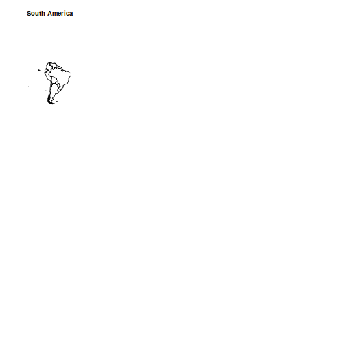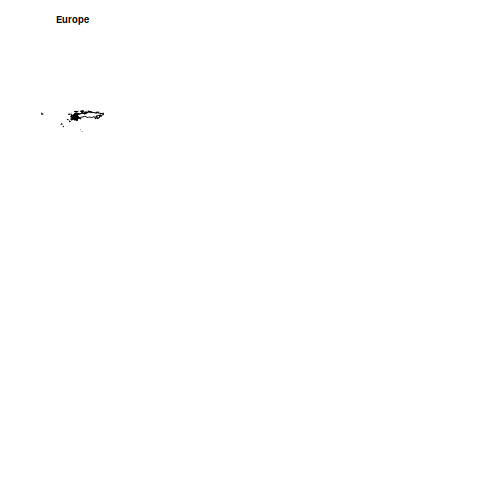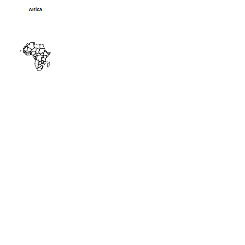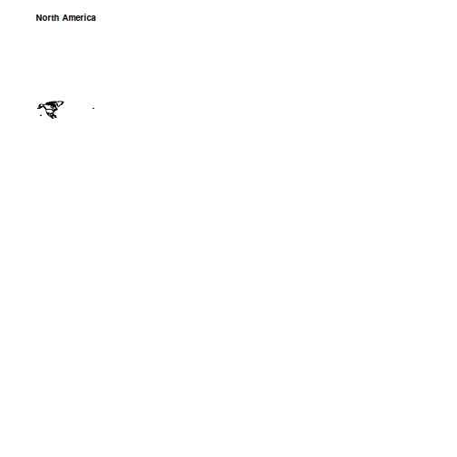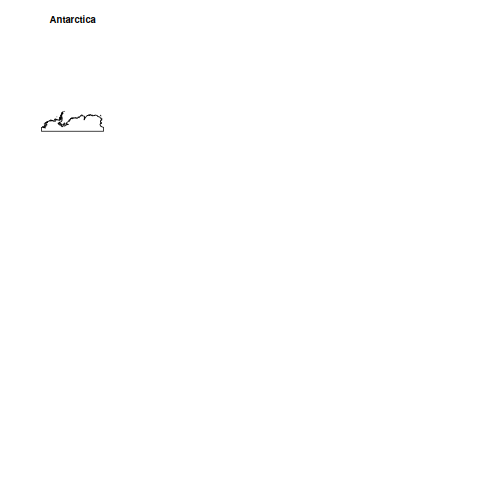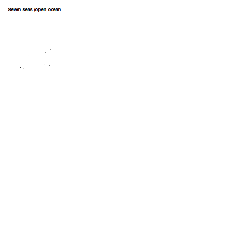
