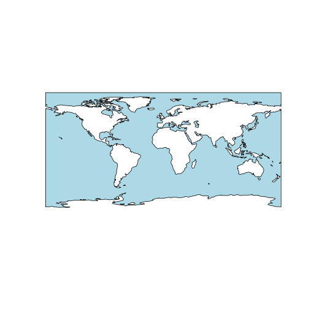
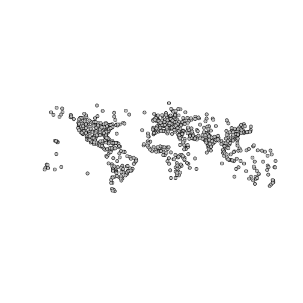
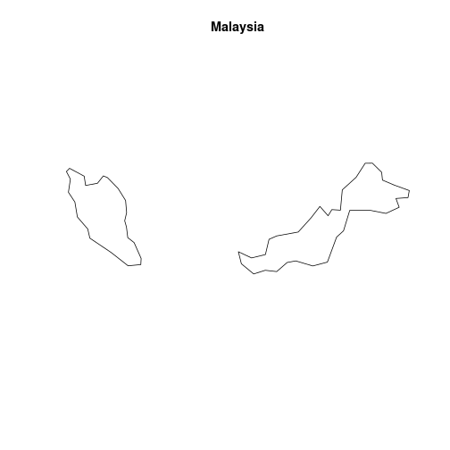
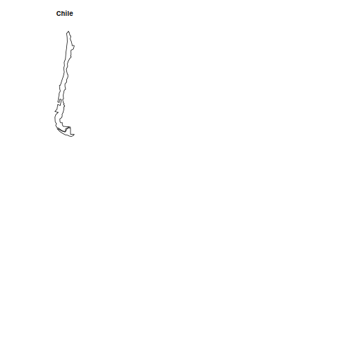
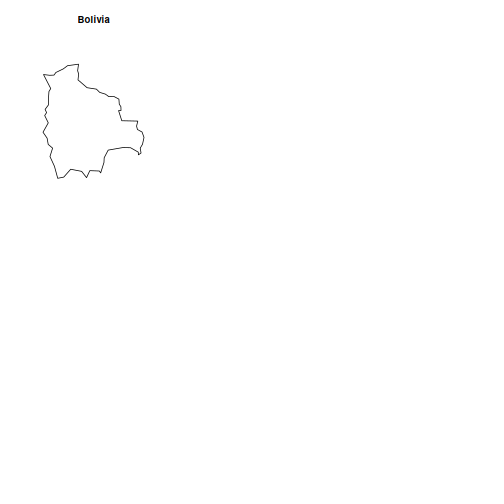
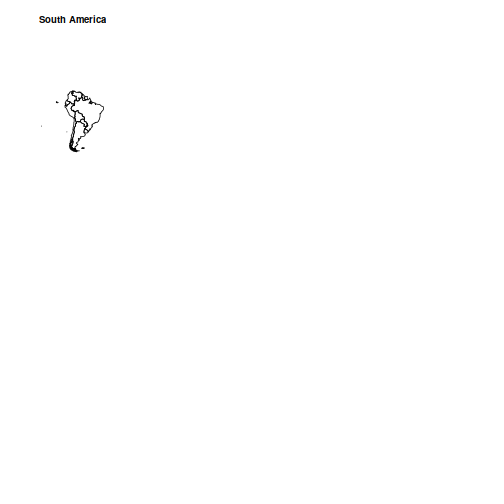
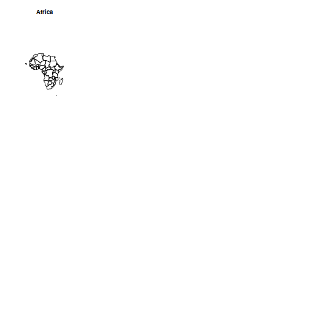
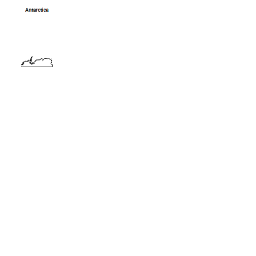
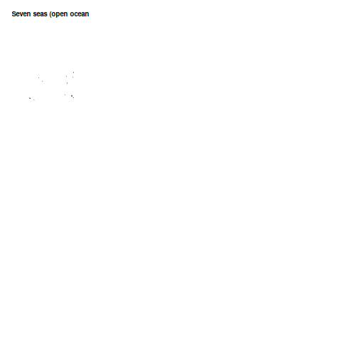

```r
library(rnaturalearth)
library(sf)
```

## Available data

There are a lot of data that can be downloaded from [Natural Earth](https://www.naturalearthdata.com/) with `ne_download()`. These data are divided into two main categories: *physical* and *cultural* vector data. The `df_layers_physical` and `df_layers_cultural` data frames included in the `rnaturalearth` packages show what layer of data can be downloaded.

### Physical vector data


```r
data(df_layers_physical)

knitr::kable(
  df_layers_physical,
  caption = "physical vector data available via ne_download()"
)
```


Table: physical vector data available via ne_download()

|layer                              | scale10| scale50| scale110|
|:----------------------------------|-------:|-------:|--------:|
|antarctic_ice_shelves_lines        |       1|       1|        0|
|antarctic_ice_shelves_polys        |       1|       1|        0|
|coastline                          |       1|       1|        1|
|geographic_lines                   |       1|       1|        1|
|geography_marine_polys             |       1|       1|        1|
|geography_regions_elevation_points |       1|       1|        1|
|geography_regions_points           |       1|       1|        1|
|geography_regions_polys            |       1|       1|        1|
|glaciated_areas                    |       1|       1|        1|
|lakes                              |       1|       1|        1|
|lakes_europe                       |       1|       0|        0|
|lakes_historic                     |       1|       1|        0|
|lakes_north_america                |       1|       0|        0|
|lakes_pluvial                      |       1|       0|        0|
|land                               |       1|       1|        1|
|land_ocean_label_points            |       1|       0|        0|
|land_ocean_seams                   |       1|       0|        0|
|land_scale_rank                    |       1|       0|        0|
|minor_islands                      |       1|       0|        0|
|minor_islands_coastline            |       1|       0|        0|
|minor_islands_label_points         |       1|       0|        0|
|ocean                              |       1|       1|        1|
|ocean_scale_rank                   |       1|       0|        0|
|playas                             |       1|       1|        0|
|reefs                              |       1|       0|        0|
|rivers_europe                      |       1|       0|        0|
|rivers_lake_centerlines            |       1|       1|        1|
|rivers_lake_centerlines_scale_rank |       1|       1|        0|
|rivers_north_america               |       1|       0|        0|


Based on the previous table, we know that we can download the `ocean` vector at small scale (110). Note that scales are defined as one of `110`, `50`, `10` or `small`, `medium`, `large`.


```r
plot(
  ne_download(type = "ocean", category = "physical", scale = "small")["geometry"],
  col = "lightblue"
)
#> Reading layer `ne_110m_ocean' from data source 
#>   `/tmp/RtmpapHyoT/ne_110m_ocean.shp' using driver `ESRI Shapefile'
#> Warning in CPL_read_ogr(dsn, layer, query,
#> as.character(options), quiet, : GDAL Message 1:
#> /tmp/RtmpapHyoT/ne_110m_ocean.shp contains polygon(s) with
#> rings with invalid winding order. Autocorrecting them, but
#> that shapefile should be corrected using ogr2ogr for
#> example.
#> Simple feature collection with 2 features and 3 fields
#> Geometry type: POLYGON
#> Dimension:     XY
#> Bounding box:  xmin: -180 ymin: -85.60904 xmax: 180 ymax: 90
#> Geodetic CRS:  WGS 84
```



### Cultural vector data


```r
data(df_layers_cultural)

knitr::kable(
  df_layers_cultural,
  caption = "cultural vector data available via ne_download()"
)
```


Table: cultural vector data available via ne_download()

|layer                                           | scale10| scale50| scale110|
|:-----------------------------------------------|-------:|-------:|--------:|
|admin_0_antarctic_claim_limit_lines             |       1|       0|        0|
|admin_0_antarctic_claims                        |       1|       0|        0|
|admin_0_boundary_lines_disputed_areas           |       1|       1|        0|
|admin_0_boundary_lines_land                     |       1|       1|        1|
|admin_0_boundary_lines_map_units                |       1|       0|        0|
|admin_0_boundary_lines_maritime_indicator       |       1|       1|        0|
|admin_0_boundary_map_units                      |       0|       1|        0|
|admin_0_breakaway_disputed_areas                |       0|       1|        0|
|admin_0_countries                               |       1|       1|        1|
|admin_0_countries_lakes                         |       1|       1|        1|
|admin_0_disputed_areas                          |       1|       0|        0|
|admin_0_disputed_areas_scale_rank_minor_islands |       1|       0|        0|
|admin_0_label_points                            |       1|       0|        0|
|admin_0_map_subunits                            |       1|       1|        0|
|admin_0_map_units                               |       1|       1|        1|
|admin_0_pacific_groupings                       |       1|       1|        1|
|admin_0_scale_rank                              |       1|       1|        1|
|admin_0_scale_rank_minor_islands                |       1|       0|        0|
|admin_0_seams                                   |       1|       0|        0|
|admin_0_sovereignty                             |       1|       1|        1|
|admin_0_tiny_countries                          |       0|       1|        1|
|admin_0_tiny_countries_scale_rank               |       0|       1|        0|
|admin_1_label_points                            |       1|       0|        0|
|admin_1_seams                                   |       1|       0|        0|
|admin_1_states_provinces                        |       1|       1|        1|
|admin_1_states_provinces_lakes                  |       1|       1|        1|
|admin_1_states_provinces_lines                  |       1|       1|        1|
|admin_1_states_provinces_scale_rank             |       1|       1|        1|
|airports                                        |       1|       1|        0|
|parks_and_protected_lands_area                  |       1|       0|        0|
|parks_and_protected_lands_line                  |       1|       0|        0|
|parks_and_protected_lands_point                 |       1|       0|        0|
|parks_and_protected_lands_scale_rank            |       1|       0|        0|
|populated_places                                |       1|       1|        1|
|populated_places_simple                         |       1|       1|        1|
|ports                                           |       1|       1|        0|
|railroads                                       |       1|       0|        0|
|railroads_north_america                         |       1|       0|        0|
|roads                                           |       1|       0|        0|
|roads_north_america                             |       1|       0|        0|
|time_zones                                      |       1|       0|        0|
|urban_areas                                     |       1|       1|        0|
|urban_areas_landscan                            |       1|       0|        0|


```r
plot(
  ne_download(
    type = "airports",
    category = "cultural",
    scale = 10
  )["geometry"],
  pch = 21,
  bg = "grey"
)
#> Reading layer `ne_10m_airports' from data source 
#>   `/tmp/RtmpapHyoT/ne_10m_airports.shp' using driver `ESRI Shapefile'
#> Simple feature collection with 893 features and 40 fields
#> Geometry type: POINT
#> Dimension:     XY
#> Bounding box:  xmin: -175.1356 ymin: -53.78147 xmax: 179.1954 ymax: 78.24672
#> Geodetic CRS:  WGS 84
```



## Searching for countries and continents

In this article, we explore how we can search for data available to download within `rnaturalearth`. Let's begin by loading country data using the `read_sf()` function from the `sf` package. In the following code snippet, we read the Natural Earth dataset, which contains information about the sovereignty of countries.


```r
df <- read_sf("/vsizip/vsicurl/https://www.naturalearthdata.com/http//www.naturalearthdata.com/download/10m/cultural/ne_10m_admin_0_sovereignty.zip")

head(df)
#> Simple feature collection with 6 features and 168 fields
#> Geometry type: MULTIPOLYGON
#> Dimension:     XY
#> Bounding box:  xmin: -109.4537 ymin: -55.9185 xmax: 140.9776 ymax: 7.35578
#> Geodetic CRS:  WGS 84
#> # A tibble: 6 × 169
#>   featurecla   scalerank LABELRANK SOVEREIGNT SOV_A3 ADM0_DIF
#>   <chr>            <int>     <int> <chr>      <chr>     <int>
#> 1 Admin-0 sov…         5         2 Indonesia  IDN           0
#> 2 Admin-0 sov…         5         3 Malaysia   MYS           0
#> 3 Admin-0 sov…         0         2 Chile      CHL           0
#> 4 Admin-0 sov…         0         3 Bolivia    BOL           0
#> 5 Admin-0 sov…         0         2 Peru       PER           0
#> 6 Admin-0 sov…         0         2 Argentina  ARG           0
#> # ℹ 163 more variables: LEVEL <int>, TYPE <chr>, TLC <chr>,
#> #   ADMIN <chr>, ADM0_A3 <chr>, GEOU_DIF <int>,
#> #   GEOUNIT <chr>, GU_A3 <chr>, SU_DIF <int>, SUBUNIT <chr>,
#> #   SU_A3 <chr>, BRK_DIFF <int>, NAME <chr>,
#> #   NAME_LONG <chr>, BRK_A3 <chr>, BRK_NAME <chr>,
#> #   BRK_GROUP <chr>, ABBREV <chr>, POSTAL <chr>,
#> #   FORMAL_EN <chr>, FORMAL_FR <chr>, NAME_CIAWF <chr>, …
```

### Finding countries

One way to search for countries is to search within the `ADMIN` vector. Let's start by plotting some of the first countries.


```r
lapply(df$ADMIN[1:6], \(x) {
  plot(ne_countries(country = x)["geometry"], main = x)
})
```



Suppose that we want to search the polygons for the US, how should we spell it?


```r
ne_countries(country = "USA")
ne_countries(country = "United States")
ne_countries(country = "United States Of America")
ne_countries(country = "United States of America")
```

One possibility consists to search within the `ADMIN` vector using a regular expression to find all occurrences of the word *states*.


```r
df$ADMIN[grepl("states", df$ADMIN, ignore.case = TRUE)]
#> [1] "United States of America"      
#> [2] "Federated States of Micronesia"
```
We can now get the data.


```r
plot(ne_countries(country = "United States of America")["geometry"])
```


### Continents

Finally, let's create plots for each continent using the `ne_countries` function with the continent parameter.


```r
unique(df$CONTINENT)
#> [1] "Asia"                    "South America"          
#> [3] "Europe"                  "Africa"                 
#> [5] "North America"           "Oceania"                
#> [7] "Antarctica"              "Seven seas (open ocean)"
```


```r
lapply(unique(df$CONTINENT), \(x) {
  plot(
    ne_countries(
      continent = x,
      scale = "medium"
    )["geometry"],
    main = x
  )
})
```


