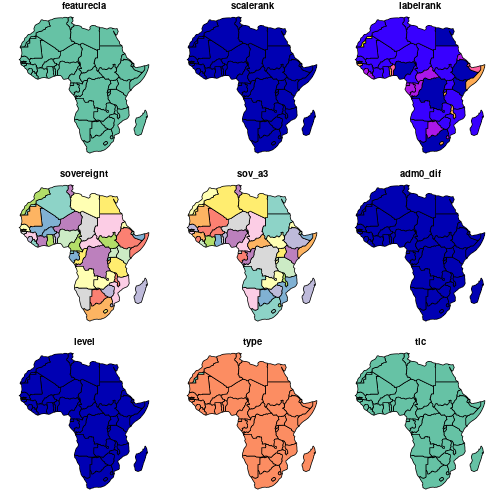
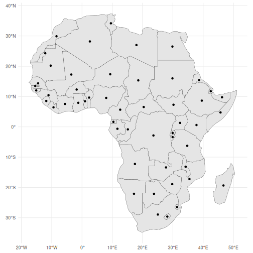
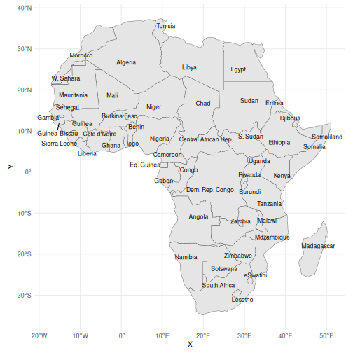
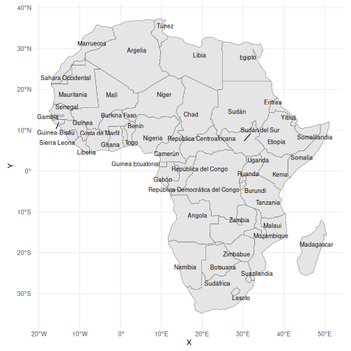
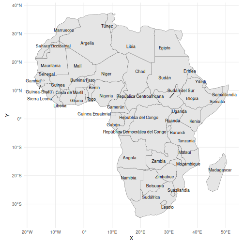
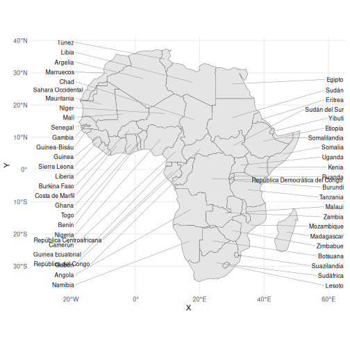
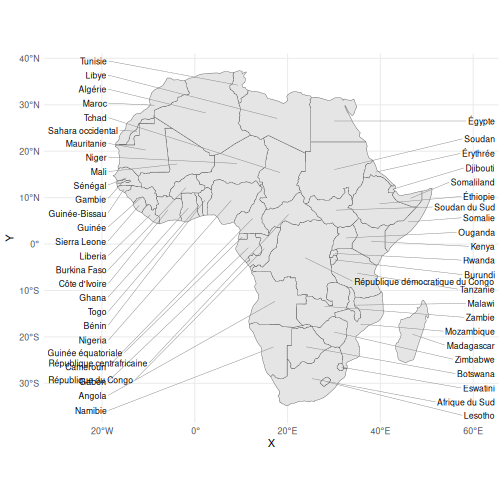
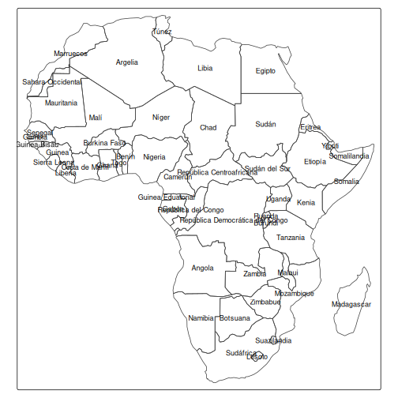
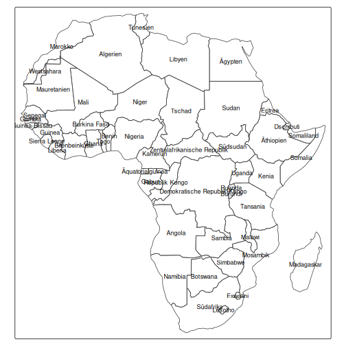

This vignette shows how [rnaturalearth](https://github.com/ropensci/rnaturalearth) makes it easier to make maps with labels in languages other than Engish, and to make thematic maps if you have data that is referenced in languages other than Engish.

[rnaturalearth](https://github.com/ropensci/rnaturalearth) is an R package to hold and facilitate interaction with natural earth vector map data.

[Natural Earth](https://www.naturalearthdata.com/) is a public domain map dataset including vector country boundaries.


## Load required packages


```r
library(rnaturalearth)
library(sf)
library(ggplot2)
library(ggrepel)
library(tmap)
library(knitr)

theme_set(theme_minimal())

sf_use_s2(FALSE)
```

## Country maps with labels in other languages


```r
# Africa
terra::plot(ne_countries(continent = "africa"))
#> Warning: plotting the first 9 out of 168 attributes; use
#> max.plot = 168 to plot all
```



```r

sfaf <- ne_countries(continent = "africa", returnclass = "sf")
sfafc <- st_centroid(sfaf)
#> Warning: st_centroid assumes attributes are constant over
#> geometries
#> Warning in st_centroid.sfc(st_geometry(x),
#> of_largest_polygon = of_largest_polygon): st_centroid does
#> not give correct centroids for longitude/latitude data

sfaf <- cbind(sfaf, st_coordinates(st_centroid(sfaf$geometry)))
#> Warning in st_centroid.sfc(sfaf$geometry): st_centroid does
#> not give correct centroids for longitude/latitude data

# this adds centroids in the middle of countries
ggplot(sfaf) +
  geom_sf() +
  geom_sf(data = sfafc)
```



```r

# trying labels in the middle of countries, doesn't quite work needs x,y,label
# but once x & y added on with st_coordinates ... seems getting the coords might
# not be necessary for much longer https://github.com/slowkow/ggrepel/issues/111
# cool nearly there ...
ggplot(sfaf) +
  geom_sf() +
  geom_text_repel(aes(x = X, y = Y, label = name), size = 3)
```



```r

# getting there, labels still overlap a bit maybe make map bigger to allow space
# for labels
ggplot(sfaf) +
  geom_sf() +
  geom_text_repel(aes(x = X, y = Y, label = name_es), size = 3)
```



```r

# point.padding=NA allows labels to overlap the centroid
ggplot(sfaf) +
  geom_sf() +
  geom_text_repel(
    aes(x = X, y = Y, label = name_es),
    point.padding = NA,
    size = 3
  )
```



```r

# Africa labels just down left & right sides works pretty well I think
ggplot(sfaf) +
  geom_sf() +
  xlim(-28, 61) +
  geom_text_repel(
    aes(x = X, y = Y, label = name_es),
    data = subset(sfaf, X > 21),
    nudge_x = 60 - subset(sfaf, X > 21)$X,
    segment.size = 0.2,
    segment.color = "grey50",
    direction = "y",
    hjust = 0,
    size = 3
  ) +
  geom_text_repel(
    aes(x = X, y = Y, label = name_es),
    data = subset(sfaf, X < 21),
    nudge_x = -19 - subset(sfaf, X < 21)$X,
    segment.size = 0.2,
    segment.color = "grey50",
    direction = "y",
    hjust = 1,
    size = 3
  )
```



```r

# french labels
ggplot(sfaf) +
  geom_sf() +
  xlim(-28, 61) +
  geom_text_repel(
    aes(x = X, y = Y, label = name_fr),
    data = subset(sfaf, X > 21),
    nudge_x = 60 - subset(sfaf, X > 21)$X,
    segment.size = 0.2,
    segment.color = "grey50",
    direction = "y",
    hjust = 0,
    size = 3
  ) +
  geom_text_repel(
    aes(x = X, y = Y, label = name_fr),
    data = subset(sfaf, X < 21),
    nudge_x = -19 - subset(sfaf, X < 21)$X,
    segment.size = 0.2,
    segment.color = "grey50",
    direction = "y",
    hjust = 1,
    size = 3
  )
```



```r

# tmap good but labels currently overlap

# english labels
tm_shape(sfaf) +
  tm_borders() +
  tm_text("name", size = 0.75)
```


```r

# spanish labels
tm_shape(sfaf) +
  tm_borders() +
  tm_text("name_es", size = 0.75)
```



```r

# other languages de, fr, nl,
tm_shape(sfaf) +
  tm_borders() +
  tm_text("name_de", size = 0.75)
```


