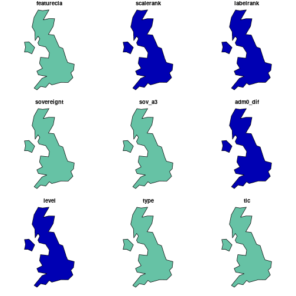
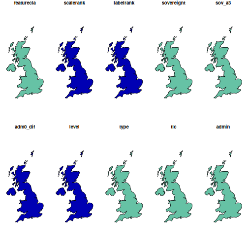
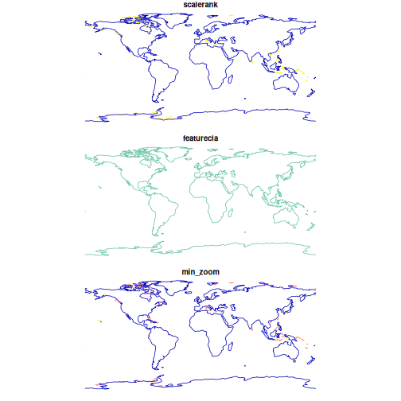

This vignette is an introduction to [rnaturalearth](https://github.com/ropensci/rnaturalearth), an R package to hold and facilitate interaction with natural earth vector map data. `rnaturalearth` is a data package designed to provide map data that can be visualised using other R packages.

[Natural Earth](https://www.naturalearthdata.com/) is a public domain map dataset including vector country and other administrative boundaries.

[rnaturalearth](https://github.com/ropensci/rnaturalearth) does two main things.

1. Contains pre-downloaded vector maps for :
    + countries `ne_countries()`
    + states `ne_states()`
    + coastline `ne_coastline()`

1. Has `ne_download()` function to facilitate download of other vector and raster maps.

This vignette uses `plot` as a simple, quick way to show how different data can be accessed.`rnaturalearth` is designed to provide data allowing creation of more elaborate maps in other visualisation packages (e.g. `ggplot2`, `tmap` and `choroplethr`).

## load required packages


```r
library(rnaturalearth)
```

## Maps in the package.

Pre-downloaded maps can be accessed with :

- `ne_countries()` for country (admin-0) boundaries
- `ne_states()` for boundaries within countries (admin-1)
- `ne_coastline()` for world coastline


```r
# world at small scale (low resolution)
plot(ne_countries(type = "countries", scale = "small"))
#> Warning: plotting the first 10 out of 168 attributes; use
#> max.plot = 168 to plot all
```


```r

# countries, UK undivided
plot(ne_countries(country = "united kingdom", type = "countries"))
#> Warning: plotting the first 9 out of 168 attributes; use
#> max.plot = 168 to plot all
```


```r
# map_units, UK divided into England, Scotland, Wales and Northern Ireland
plot(ne_countries(country = "united kingdom", type = "map_units"))
#> Warning: plotting the first 9 out of 168 attributes; use
#> max.plot = 168 to plot all
```


```r

# countries, small scale
plot(ne_countries(country = "united kingdom", scale = "small"))
#> Warning: plotting the first 9 out of 168 attributes; use
#> max.plot = 168 to plot all
```



```r

# countries, medium scale
plot(ne_countries(country = "united kingdom", scale = "medium"))
#> Warning: plotting the first 10 out of 168 attributes; use
#> max.plot = 168 to plot all
```




```r
# not evaluated because rely on rnaturalearthhires data which are on rOpenSci so CRAN check likely to fail

# countries, large scale
plot(ne_countries(country = "united kingdom", scale = "large"))

# states country='united kingdom'
plot(ne_states(country = "united kingdom"))
# states geounit='england'
plot(ne_states(geounit = "england"))

# states country='france'
plot(ne_states(country = "france"))
```


```r
# coastline of the world
# subsetting of coastline is not possible because the Natural Earth data are not attributed in that way
plot(ne_coastline())
```



## Downloading other Natural Earth vectors with ne_download().

Each [Natural Earth](https://www.naturalearthdata.com/) dataset is characterised on the website according to `scale`, `type` and `category`. [rnaturalearth](https://github.com/ropensci/rnaturalearth) allows you to specify `scale`, `type` and `category` and will construct the url and download the corresponding file.


```r
# lakes
lakes110 <- ne_download(scale = 110, type = "lakes", category = "physical")
plot(lakes110, col = "blue")

# rivers
rivers110 <- ne_download(scale = 110, type = "rivers_lake_centerlines", category = "physical")
plot(rivers110, col = "blue")
```

## Tables of vector layers available via `ne_download(type=[layer_name], scale=)`
1=available, 0=not


Table: category='physical' vector data available via ne_download()

|layer                              | scale10| scale50| scale110|
|:----------------------------------|-------:|-------:|--------:|
|antarctic_ice_shelves_lines        |       1|       1|        0|
|antarctic_ice_shelves_polys        |       1|       1|        0|
|coastline                          |       1|       1|        1|
|geographic_lines                   |       1|       1|        1|
|geography_marine_polys             |       1|       1|        1|
|geography_regions_elevation_points |       1|       1|        1|
|geography_regions_points           |       1|       1|        1|
|geography_regions_polys            |       1|       1|        1|
|glaciated_areas                    |       1|       1|        1|
|lakes                              |       1|       1|        1|
|lakes_europe                       |       1|       0|        0|
|lakes_historic                     |       1|       1|        0|
|lakes_north_america                |       1|       0|        0|
|lakes_pluvial                      |       1|       0|        0|
|land                               |       1|       1|        1|
|land_ocean_label_points            |       1|       0|        0|
|land_ocean_seams                   |       1|       0|        0|
|land_scale_rank                    |       1|       0|        0|
|minor_islands                      |       1|       0|        0|
|minor_islands_coastline            |       1|       0|        0|
|minor_islands_label_points         |       1|       0|        0|
|ocean                              |       1|       1|        1|
|ocean_scale_rank                   |       1|       0|        0|
|playas                             |       1|       1|        0|
|reefs                              |       1|       0|        0|
|rivers_europe                      |       1|       0|        0|
|rivers_lake_centerlines            |       1|       1|        1|
|rivers_lake_centerlines_scale_rank |       1|       1|        0|
|rivers_north_america               |       1|       0|        0|


Table: category='cultural' vector data available via ne_download()

|layer                                           | scale10| scale50| scale110|
|:-----------------------------------------------|-------:|-------:|--------:|
|admin_0_antarctic_claim_limit_lines             |       1|       0|        0|
|admin_0_antarctic_claims                        |       1|       0|        0|
|admin_0_boundary_lines_disputed_areas           |       1|       1|        0|
|admin_0_boundary_lines_land                     |       1|       1|        1|
|admin_0_boundary_lines_map_units                |       1|       0|        0|
|admin_0_boundary_lines_maritime_indicator       |       1|       1|        0|
|admin_0_boundary_map_units                      |       0|       1|        0|
|admin_0_breakaway_disputed_areas                |       0|       1|        0|
|admin_0_countries                               |       1|       1|        1|
|admin_0_countries_lakes                         |       1|       1|        1|
|admin_0_disputed_areas                          |       1|       0|        0|
|admin_0_disputed_areas_scale_rank_minor_islands |       1|       0|        0|
|admin_0_label_points                            |       1|       0|        0|
|admin_0_map_subunits                            |       1|       1|        0|
|admin_0_map_units                               |       1|       1|        1|
|admin_0_pacific_groupings                       |       1|       1|        1|
|admin_0_scale_rank                              |       1|       1|        1|
|admin_0_scale_rank_minor_islands                |       1|       0|        0|
|admin_0_seams                                   |       1|       0|        0|
|admin_0_sovereignty                             |       1|       1|        1|
|admin_0_tiny_countries                          |       0|       1|        1|
|admin_0_tiny_countries_scale_rank               |       0|       1|        0|
|admin_1_label_points                            |       1|       0|        0|
|admin_1_seams                                   |       1|       0|        0|
|admin_1_states_provinces                        |       1|       1|        1|
|admin_1_states_provinces_lakes                  |       1|       1|        1|
|admin_1_states_provinces_lines                  |       1|       1|        1|
|admin_1_states_provinces_scale_rank             |       1|       1|        1|
|airports                                        |       1|       1|        0|
|parks_and_protected_lands_area                  |       1|       0|        0|
|parks_and_protected_lands_line                  |       1|       0|        0|
|parks_and_protected_lands_point                 |       1|       0|        0|
|parks_and_protected_lands_scale_rank            |       1|       0|        0|
|populated_places                                |       1|       1|        1|
|populated_places_simple                         |       1|       1|        1|
|ports                                           |       1|       1|        0|
|railroads                                       |       1|       0|        0|
|railroads_north_america                         |       1|       0|        0|
|roads                                           |       1|       0|        0|
|roads_north_america                             |       1|       0|        0|
|time_zones                                      |       1|       0|        0|
|urban_areas                                     |       1|       1|        0|
|urban_areas_landscan                            |       1|       0|        0|


