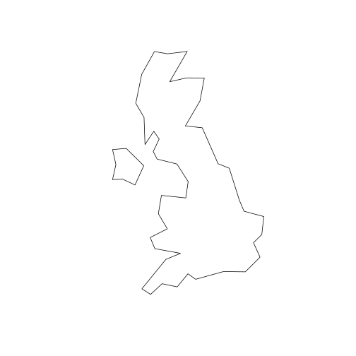
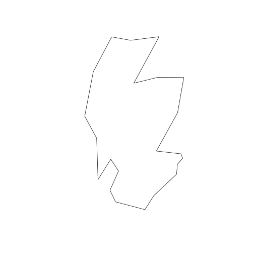
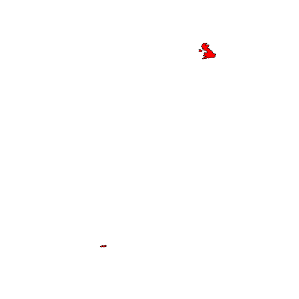
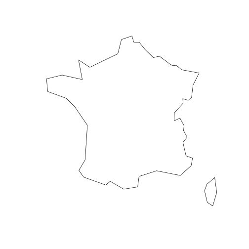
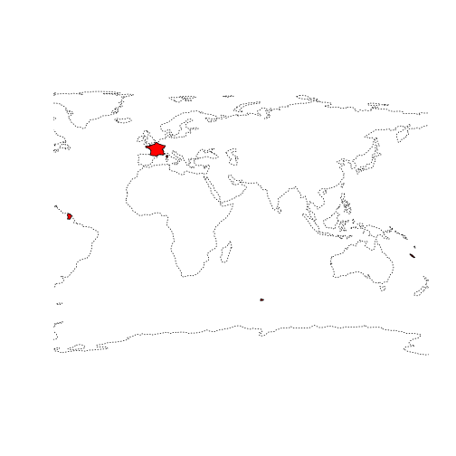
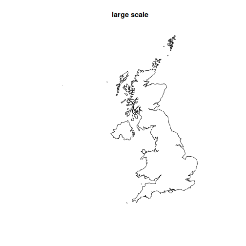
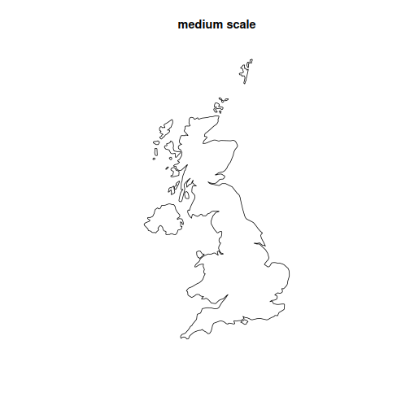
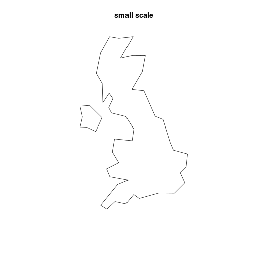
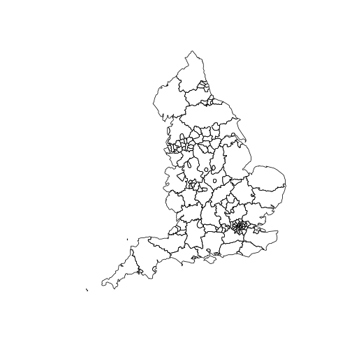
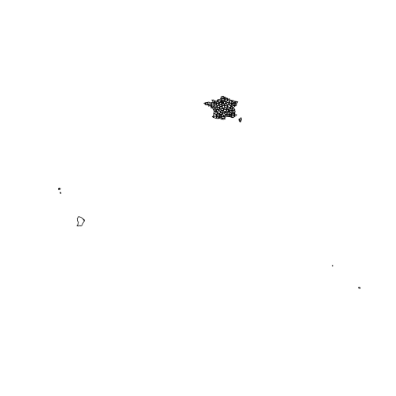

This vignette shows how [rnaturalearth](https://github.com/ropensci/rnaturalearth) allows mapping countries using different definitions of what a country is. What a country is can be more complicated than you might expect.

For example, from my own parochial perspective, it allows mapping the UK as a whole or separating out England, Scotland, Wales and Northern Ireland. It also allows you to exclude far away places like the Falkland Islands, or not. Mapping France it allows the inclusion or exclusion of French Guiana and islands in the South Pacific.

[rnaturalearth](https://github.com/ropensci/rnaturalearth) is an R package to hold and facilitate interaction with natural earth vector map data.

[Natural Earth](https://www.naturalearthdata.com/) is a public domain map dataset including vector country boundaries.

This vignette uses `plot` as a simple, quick way to plot the data obtained using `rnaturalearth`. `rnaturalearth` data can also be used to make more elaborate maps with `ggplot2`, `tmap` and other options.

## Load required packages


```r
library(rnaturalearth)
```

## Country types : countries, map_units and sovereignty
Natural Earth data are classified by `countries`, `map_units` and `sovereignty`. Below you will see that specifying `united kingdom` for

- `countries` gives the UK undivided
- `map_units` gives England, Scotland, Wales and Northern Ireland
- `sovereignty` includes the Falkland Islands

Filtering by `geounit` can give finer control, e.g. to plot Scotland alone, or France without French Guiana.


```r
# countries, UK undivided
plot(ne_countries(country = "united kingdom", type = "countries")["geometry"])
```



```r

# map_units, UK divided into England, Scotland, Wales and Northern Ireland
plot(ne_countries(country = "united kingdom", type = "map_units")["geometry"])
```


```r

# map_units, select by geounit to plot Scotland alone
plot(ne_countries(geounit = "scotland", type = "map_units")["geometry"])
```



```r

# sovereignty, Falkland Islands included in UK
plot(ne_countries(country = "united kingdom", type = "sovereignty")["geometry"], col = "red")
plot(ne_coastline(scale = 110)["geometry"], lty = 3, add = TRUE)
```



```r

# France, country includes French Guiana
plot(ne_countries(country = "france")["geometry"])

# France map_units includes French Guiana too
plot(ne_countries(country = "france", type = "map_units")["geometry"])
```


```r

# France filter map_units by geounit to exclude French Guiana
plot(ne_countries(geounit = "france", type = "map_units")["geometry"])
```



```r

# France sovereignty includes South Pacicic islands
plot(ne_countries(country = "france", type = "sovereignty")["geometry"], col = "red")
plot(ne_coastline(scale = 110)["geometry"], lty = 3, add = TRUE)
```



## Country scales : small, medium and large

The different definitions of a country outlined above are available at different scales.


```r
plot(
  ne_countries(country = "united kingdom", scale = "large")["geometry"],
  main = "large scale"
)
```



```r

# countries, medium scale
plot(
  ne_countries(country = "united kingdom", scale = "medium")["geometry"],
  main = "medium scale"
)
```



```r

# countries, small scale
plot(
  ne_countries(country = "united kingdom", scale = "small")["geometry"],
  main = "small scale"
)
```



## States, admin level 1, select by country or geounit


```r
# states country='united kingdom'
plot(ne_states(country = "united kingdom")["geometry"])
```


```r

# states geounit='england'
plot(ne_states(geounit = "england")["geometry"])
```



```r

# states country='france'
plot(ne_states(country = "france")["geometry"])
```



```r

# states geounit='france'
plot(ne_states(geounit = "france")["geometry"])
```


